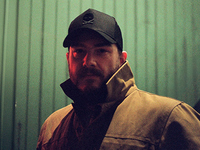

---js
const eleventyNavigation = {
	key: "About Me",
	order: 2
};
---
## About Me

<picture>
    <source media="(min-width: 50em)" srcset="../static/img/zack-about.jpg, ../static//img/zack-about@2x.jpg 2x" type="image/jpeg">
    <source srcset="../static/img/zack-about-small.webp, ../static/img/zack-about-small@2x.webp 2x" type="image/webp">
    
</picture>

Hey. Hi. I am Zachary or Zack (Why a K? Long story.) I am Web and UI Designer and Developer for [Bindable](https://www.bindable.com). I live in Boston, MA. 

When I am not working I can be found at the gym, at the movies and diving into my photography. I love both digital and film photography and enjoy both. I am always looking for new and interesting ways to use and further develop my skills not only in the web but also as a photographer.

You can check out some of my photography on my [Instagram](https://www.instagram.com/zachjewellphoto).

Photo by [Steve Abodeely](https://stabodeely.com/).

