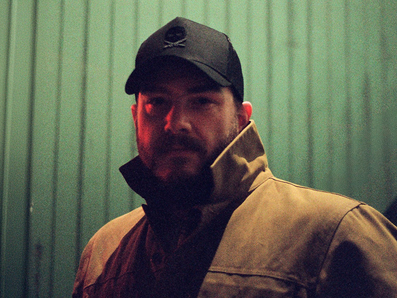

---js
const eleventyNavigation = {
	key: "About Me",
	order: 2
};
---
<h2 class="page-title">About Me</h2>

<figure>
  <picture>
    <source srcset="../static/img/zack-about.jpg 1x, ../static/img/zack-about@2x.jpg 2x" media="(min-width: 768px)">
    <source srcset="../static/img/zack-about-small.jpg 1x, ../static/img/zack-about-small@2x.jpg 2x" media="(max-width: 767px)">
    
  </picture>
  <figcaption>Photo by <a href="https://stabodeely.com/"> Steve Abodeely</a></figcaption>
</figure>

Hey. Hi. I am Zachary or Zack (Why a K? Long story.) I am Web/UI Designer/Developer/Engineer. I recently worked for [Bindable](https://www.bindable.com). I currently live in Boston, MA area. 

When I am not working I can be found at the gym, hiking and camping in the White Mountains where I am currently working on completing the NH 48 over 4000. I know its a lot of hiking. My favorite hike so far is Mount Washington via Ammonosuc Ravine and Jewell Trail. (No relation?)

I love both digital and film photography and enjoy both. I am always looking for new and interesting ways to use and further develop my skills not only in the web but also as a photographer.

You can check out some of my photography on my [Instagram](https://www.instagram.com/zachjewellphoto).

[My Job History/Resumé/CV](/cv) if you want to learn more in detail. Yes...those last two are true.

