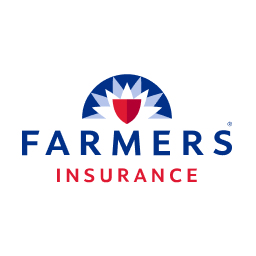
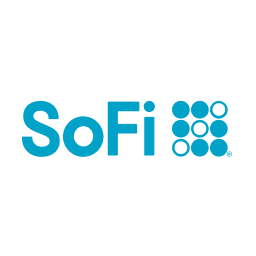
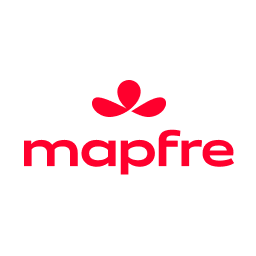
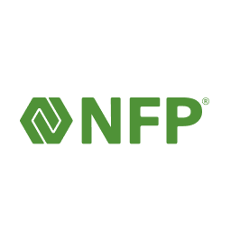

---js
const eleventyNavigation = {
	key: "My Work",
	order: 3
};
---
<h2 class="page-title">What do I do?</h2>

### Websites...mostly
I started my web design career as Responsive Web Design was bursting onto the World Wide Web. Since then, I have worked on many web projects (and some non-web). I’ve worked across a range of environments, from individual projects to large-scale corporate initiatives, collaborating closely with teams to build responsive, user-centered interfaces and design systems. I bring a unique blend of creativity, technical skill, and a dash or two of humor to every project. My entire career has been spent bridging the gap between design and development. My approach is rooted in thoughtful design and code. I operate with the mindset of iteration and trial/error to get the desired outcome.

### What am I doing right now?
Right now? Probably working on something because I sometimes can't turn my brain off. OK, but really...I was a UI Designer and Front-end Developer for an InsureTech company called [Bindable](http://www.bindable.com). What did I do? I made websites while also maintaining and building out new features for the product platforms like the consumer content site, quoting funnel, and agency back-end application. My skills are always evolving from learning new programs (Sketch, Figma, Adobe, etc.) to keeping up with the latest and greatest web features like Modern CSS features (my personal favorite), Web Components, and others. I am a person that will take the time to learn something. I do a lot and work hard when I am not cracking a joke in Slack or Zoom. 

### Some Groups/Companies I Have Worked With

  <picture>
    <source srcset="../static/img/farmers-logo.svg" type="image/svg+xml">
    
  </picture>
  <picture>
    <source srcset="../static/img/sofi-logo.svg" type="image/svg+xml">
    
  </picture>
  <picture>
    <source srcset="../static/img/mapfre-logo.svg" type="image/svg+xml">
    
  </picture>
  <picture>
    <source srcset="../static/img/nfp-logo.svg" type="image/svg+xml">
    
  </picture>

Arsenal Performance, Barnsley Gardens Resort, Black Dolphin Inn, Bogue Watch, Browns Landing, Combat Zone Wrestling, Daily Precast, DebtX, Farmers Insurance Group, Gallagher, Holyoke Credit Union, HUB, Huntington Bank, Luso Credit Union, Mapfre, Mario Russo Salon, Mechanics Cooperative Bank, Modern Funding, NeoFight Pro, New Seabury, NFP, PCT Credit Union, Peckham Industries, Rakks, Riverworks Credit Union, Rough Hollow Lakeway, Sisters Cove/Nest Homes, SoFi, Strategis, Ullico Select, Unipower, WASDA, Water Taxi of Fort Lauderdale, Windmill Press
